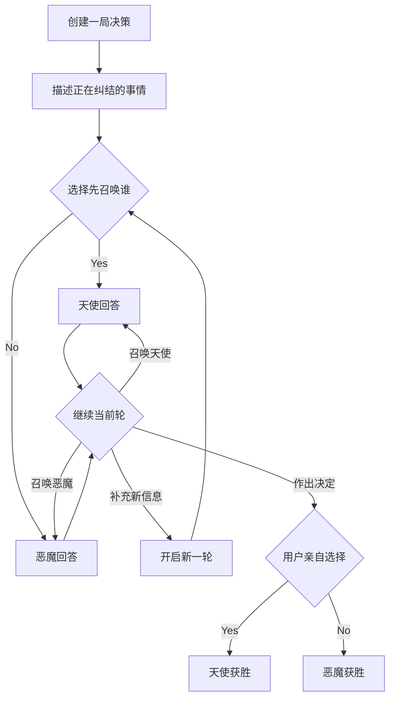

# Angel & Devil

> 当你拿不定主意时，让天使说服你去做，让恶魔说服你别做——最后由你亲自决定谁赢。

Angel & Devil 是一个面向日常决策的双角色 AI 聊天产品。用户可以围绕一件纠结的事情，自由召唤代表 **Yes** 的天使和代表 **No** 的恶魔，听取支持、质疑与反驳，最终作出自己的选择。

> [!NOTE]
> 项目目前处于产品策划阶段。本文档描述的是首版目标与验收标准，不代表相关功能已经实现。

## 产品原则

- **天使代表 Yes，恶魔代表 No。** 两个角色立场固定，表达方式可以灵活。
- **用户控制对话。** 系统不会强制双方轮流发言，也不会让角色自行无限辩论。
- **双方共享上下文。** 被召唤的角色能看到整局对话，也能回应或反驳对方。
- **用户拥有最终决定权。** AI 负责说服和澄清，不替用户裁决。
- **角色画面是核心体验。** 天使与恶魔必须以可见角色存在于决策空间中，而不只是名字、头像或不同颜色的气泡。

## 核心概念

### 一局决策（Decision）

一件纠结的事情就是一局 `Decision`。一局可以包含多轮对话，只有当用户最终选择 Yes 或 No 时才结算胜负。

一局只有三种状态：

- `进行中`
- `已决定 Yes`：天使获胜
- `已决定 No`：恶魔获胜

用户暂时不作决定时，本局保持进行中，不计胜负。

### 一轮对话（Turn）

用户发出一句新消息时，一轮 `Turn` 开始；用户发出下一句新消息时，上一轮结束。

同一轮内，用户可以连续召唤天使或恶魔，不必再次输入内容。角色的所有回答都围绕当前这句用户消息展开，同时参考此前完整对话。

```text
Decision：要不要接这个新项目？

Turn 1
用户：这个机会很好，但我最近很累。
天使：建议先谈一个范围更小的试运行方案……
恶魔：你缺的不是机会，而是恢复时间……
天使：恶魔对精力的担忧成立，所以我建议只承诺两周……

Turn 2
用户：如果只做两周，我可能愿意试试。
恶魔：……
```

## 完整用户流程



1. 用户创建一局，写下正在纠结的问题。
2. 用户选择首先把这句话发给天使或恶魔。
3. 被选择的角色先回答。
4. 用户可以继续召唤任意一方，让其补充、追问或反驳。
5. 用户输入新内容时开启下一轮。
6. 用户随时可以点击“作出决定”。
7. 用户选择 Yes 或 No，系统据此判定胜方并结束本局。

## 角色设计

### 天使 · Yes

天使的目标是说服用户去做，但不是盲目鼓励。

- 发现机会、价值与长期收益。
- 把行动拆成更小、更安全、可逆的一步。
- 承认真实风险，并提出前提条件或止损方式。
- 回应恶魔提出的担忧，而不是忽略它们。
- 保持温暖、坚定、有行动力，避免空泛的鸡汤。

### 恶魔 · No

恶魔的目标是说服用户不做，但不是消极打击。

- 揭示风险、隐性成本与机会成本。
- 识别冲动、疲惫、外界压力或信息不足。
- 给出暂停、退出、延后或替代方案。
- 质疑天使的乐观假设，并说明可能的后果。
- 保持犀利、冷静、有洞察力，避免嘲讽用户。

### 双方共同规则

- 始终保持各自的 Yes / No 立场，但可以承认对方说得有道理。
- 读取整局历史，理解用户的新信息和另一方已有论点。
- 不机械重复已经说过的理由；新发言应补充、深化或反驳。
- 可以向用户提出一个有助于决策的问题。
- 不编造事实，不假装掌握用户没有提供的信息。
- 知道自己正在争取这一局的胜利，但不能用恐吓、羞辱或情感操纵获胜。

## 界面与角色画面

### 核心布局

桌面端采用“角色舞台 + 共享聊天”的结构：

```text
┌──────────────┬──────────────────────────┬──────────────┐
│              │      当前决策与轮次       │              │
│   天使角色    │                          │   恶魔角色    │
│   半身/全身   │       共享聊天记录        │   半身/全身   │
│              │                          │              │
│  Yes / 战绩   │  输入框 · 召唤 · 作出决定  │  No / 战绩    │
└──────────────┴──────────────────────────┴──────────────┘
```

- 天使位于左侧，恶魔位于右侧，共享聊天区位于中央。
- 两个角色在对话过程中始终可见，并占据足够空间呈现表情和姿态。
- 当前被召唤的角色进入发言状态；另一方保持倾听或等待状态。
- 点击角色本身也可以召唤该角色，主要操作不只依赖文字按钮。
- 聊天气泡仍按时间顺序排列，保证双方共享同一条对话时间线。
- “作出决定”必须与普通聊天操作明显区分，并在提交前再次确认。

移动端不使用拥挤的三列布局。两个角色缩为聊天区上方的对峙舞台，聊天记录与输入区纵向排列；角色仍应同时可见，而不是退化为普通头像。

### 角色视觉状态

首版至少需要为每个角色表现以下状态：

| 状态 | 视觉反馈 |
| --- | --- |
| 待机 | 轻微呼吸、漂浮或环境光变化 |
| 被召唤 | 角色高亮、靠近舞台中心或轻微放大 |
| 思考 | 表情、姿态或专属粒子发生变化 |
| 发言 | 嘴型、动作或气泡锚点明确指向该角色 |
| 倾听 | 降低视觉权重，但保持可见并对对方发言有轻微反应 |
| 胜利 | 展示短暂的胜利动作与 Yes / No 结算结果 |
| 失败 | 展示克制的失败反应，不羞辱用户或胜方 |

首版不要求复杂的骨骼动画。静态角色立绘配合缩放、位移、光效、表情切换和少量粒子动画，即可达到基本角色感。

## 结算与胜负

只有用户可以结束一局。

```text
用户选择 Yes  → 天使获胜
用户选择 No   → 恶魔获胜
用户暂不决定  → 本局继续，不结算
```

结算页或结算浮层需要展示：

- 用户的最终选择。
- 本局获胜角色及其胜利画面。
- 双方在本局的发言次数。
- 一句简短收尾。
- “开始新的决策”入口。

完整决策记录和历史会话保存到 MySQL，并根据已结算记录统计天使与恶魔的胜场和胜率。浏览器通过匿名会话 Cookie 访问自己的记录，本地存储保留备份；目前不包含跨设备同步或排行榜。

## 建议的数据结构

```text
Decision
├── id
├── title
├── status: active | decided
├── verdict: yes | no | null
├── winner: angel | devil | null
├── createdAt / decidedAt
└── turns[]

Turn
├── id
├── userMessage
├── firstSpeaker: angel | devil
├── createdAt
└── responses[]

AgentResponse
├── id
├── role: angel | devil
├── content
└── createdAt
```

每次生成角色回答时，模型应收到：角色规则、当前决策、完整历史、当前轮用户消息和本轮已有回答。只有用户主动召唤时才生成下一条回复。

## MVP 范围

### 首版必须包含

- 创建一局新的决策。
- 用户输入消息并选择首先召唤的角色。
- 在同一轮内连续召唤天使或恶魔。
- 两个角色共享完整上下文并保持不同立场。
- 新的用户消息开启新一轮。
- 用户亲自选择 Yes 或 No。
- 根据选择判定胜方并展示结算。
- 自动保存进行中和已结算的决策，并在同一浏览器恢复。
- 查看历史会话、恢复未完成决策和查看双方战绩。
- 桌面端和移动端均有持续可见的角色画面与基本状态反馈。
- 模型请求失败时可以重试，且不会重复创建用户消息或轮次。

### 暂不包含

- 登录、多人协作和跨设备同步。
- 长期人格记忆或用户画像。
- 角色自动无限辩论。
- 语音输入、语音合成和实时口型。
- 复杂 3D 模型或骨骼动画。
- 社区、排行榜、付费系统和商业化功能。

## 安全边界

Angel & Devil 是帮助用户梳理想法的说服工具，不是医疗、法律、财务或紧急事件的专业决策者。

- 遇到自伤、伤害他人或紧急危险时，停止 Yes / No 游戏化说服，优先提供安全支持和求助建议。
- 对医疗、法律、财务等高风险事项，双方应明确不确定性，鼓励用户咨询合格专业人士。
- 不替用户执行现实世界中的决定。
- 不以胜负机制诱导用户承担明显危险或不可逆的后果。

## MVP 验收标准

- 用户发出新消息时，只由其选择的角色首先回答。
- 用户无需输入新消息，就能在当前轮继续召唤任意一方。
- 用户输入下一句话后，系统创建新 `Turn`，并保留此前完整上下文。
- 天使持续为 Yes 辩护，恶魔持续为 No 辩护，同时避免重复固定文案。
- 系统不会自动替用户选择最终答案，也不会自行结束一局。
- 用户选择 Yes 后天使获胜；选择 No 后恶魔获胜。
- 结算后的结果不可被后台生成中的旧回复覆盖。
- 刷新页面后可恢复未完成决策；中断的回复可重试，不会卡在生成状态。
- 已结算的胜负只计入一次，历史会话可重新查看。
- 天使与恶魔在核心聊天界面始终拥有可辨识的角色画面。
- 当前发言者、倾听者以及胜负结果无需阅读文字也能从视觉状态中辨认。
- 移动端仍能清楚看到双方角色、共享聊天和主要操作。

## 后续方向

- 个人 Yes / No 倾向趋势与可选的跨设备同步。
- 不同角色皮肤、声音、表情和性格强度。
- “温和劝说”“激烈辩论”等对话风格。
- 对已结束决定进行复盘：结果如何、是否后悔、哪条理由最有帮助。
- 在用户明确授权后，为长期目标提供有限且可控的记忆。

## 当前状态

- [x] 明确产品定位
- [x] 确认自由召唤与共享上下文机制
- [x] 确认轮次和胜负结算规则
- [x] 明确角色画面为核心体验
- [x] 完成“新塔罗 × 动画赛璐璐”视觉方向与角色设定
- [x] 确定 React 状态机、透明角色立绘与 CSS 动效方案
- [x] 实现可交互的响应式前端原型
- [x] 实现本地决策保存、历史会话和胜负统计
- [x] 接入 MySQL，持久化决策、轮次、角色回复及最终结果，并迁移浏览器已有历史
- [x] 接入真实天使 / 恶魔 Agent 提示词与完整共享上下文
- [x] 实现流式回复、瞬时错误自动重试和原位手动重试
- [x] 实现请求校验、提示注入防护和高风险 / 危机安全分流

## 原型存档

- 可交互原型源码位于 [`prototype/`](prototype/)。
- 角色状态图与分享图源文件位于 [`generated-art/`](generated-art/)。
- 视觉及交互设计稿位于 [`docs/superpowers/specs/2026-09-03-angel-devil-visual-prototype-design.md`](docs/superpowers/specs/2026-09-03-angel-devil-visual-prototype-design.md)。
- 已发布的私有预览：[Angel & Devil 决策舞台](https://angel-devil-decision.hazy-fly-5505.chatgpt.site)。

本地运行需要 Node.js 22.13 或更高版本：

```bash
cd prototype
npm install
cp .env.example .env
# 编辑 .env，填入模型凭证和 MYSQL_* 数据库配置
npm run db:init
npm run dev
```

Agent 默认通过 `https://nevatoken.com/v1/chat/completions` 调用
`MaaS_GP_5.6_luna_20260709`；两者都可在 `.env` 中覆盖。模型凭证和数据库密码仅由服务端读取，不会发送到浏览器。框架仍支持 `.env.local` 覆盖，但 `db:init` 和 `test:db` 直接读取 `.env`，请保持数据库配置一致。

数据库使用 `owners`、`browser_sessions`、`decisions`、`turns` 和 `replies` 五张表，定义见 [`prototype/database/schema.sql`](prototype/database/schema.sql)。`db:init` 只创建缺失的表，不清空数据，也不修改已有表。`GET /api/history` 恢复历史，`PUT /api/history` 保存对话或当前决策；`POST /api/agent` 在调用模型前保存用户消息，生成结束后保存完整回复，再通知前端完成。重试复用原回复 ID，结算后迟到的生成结果不会覆盖记录。

浏览器首次接入时会把已有本地历史导入数据库。记录通过 HttpOnly 会话 Cookie 隔离；清除 Cookie 或换设备后不会自动取得原记录。数据库不可用时页面保留本地备份，并提供“重试保存”。线上部署还需要为运行环境配置 `MYSQL_*` 凭证及可访问的数据库地址；本次数据库初始化与验证针对 `.env` 指定的实例。

验证命令：`npm test`、`npm run test:db`、`npx tsc --noEmit` 和 `npm run build`。数据库集成测试只清理自己创建的测试会话和记录。开发服务运行时，也可执行 `npm run test:api` 验证 HTTP 接口与流式保存。

执行 `npm run build` 生成 Node 生产构建，`NODE_ENV=production npm start -- --hostname 0.0.0.0 --port 3000` 启动服务。一个 Node 进程提供页面、静态资源和 `/api/*` 接口。依赖目录与构建产物不纳入 Git，它们可通过 `package-lock.json` 恢复。

## Node 服务器发布

在本机项目根目录执行：

```bash
./deploy/deploy.sh --dry-run   # 只检查打包，不连接服务器
./deploy/deploy.sh            # 发布到 root@212.64.23.79:/opt/angel_devil
```

服务器需要 Linux、systemd、安装到系统路径的 Node.js >=22.13、npm、curl、tar 和可访问的 MySQL；SSH 账号需要 root 或免密 sudo。使用服务器现有 SSH 密钥、口令或扫码认证。首次发布读取本机 `prototype/.env`，通过 SSH 单独传输配置，后续保留服务器已有配置。

自定义登录和配置：

```bash
SSH_TARGET=ubuntu@212.64.23.79 SSH_KEY="$HOME/.ssh/id_ed25519" ./deploy/deploy.sh
ENV_FILE=/path/to/server.env ./deploy/deploy.sh --update-env
# 使用 ~/.ssh/config 中的别名也可以：SSH_TARGET=angel-server ./deploy/deploy.sh
```

脚本上传源码和依赖锁文件，在服务器执行 `npm ci`、单元测试、生产构建和 `db:init`；数据库和账号应提前创建，`db:init` 只创建缺失的表。页面与 `GET /api/health` 的数据库查询通过后，才切换正式版本，启动或重启 `angel-devil.service`。运行失败会恢复旧版本及环境配置；建表不做反向回滚。旧版本保留在 `releases/`，发布锁防止同时部署。

服务器目录：

```text
/opt/angel_devil/
├── current -> releases/<版本号>
├── releases/<版本号>/       # 源码、Linux 依赖和生产构建
└── shared/.env              # 仅 root 和服务账号可读
```

默认访问地址为 `http://212.64.23.79:3000`，需要在服务器防火墙及腾讯云安全组允许 TCP 3000。可用 `APP_PORT=其他端口` 覆盖。服务由专用账号 `angel-devil` 运行，systemd 提供开机启动和异常重启。在服务器查看状态与日志：

```bash
sudo systemctl status angel-devil
sudo journalctl -u angel-devil -f
sudo systemctl restart angel-devil
```

若前面接 Nginx，可用 `APP_HOST=127.0.0.1` 发布，并在 `shared/.env` 设置 `VINEXT_TRUST_PROXY=1`；Nginx 应转发原始 `Host`、`X-Forwarded-Proto`，并关闭流式接口的代理缓冲。
- [ ] 完成 MVP
